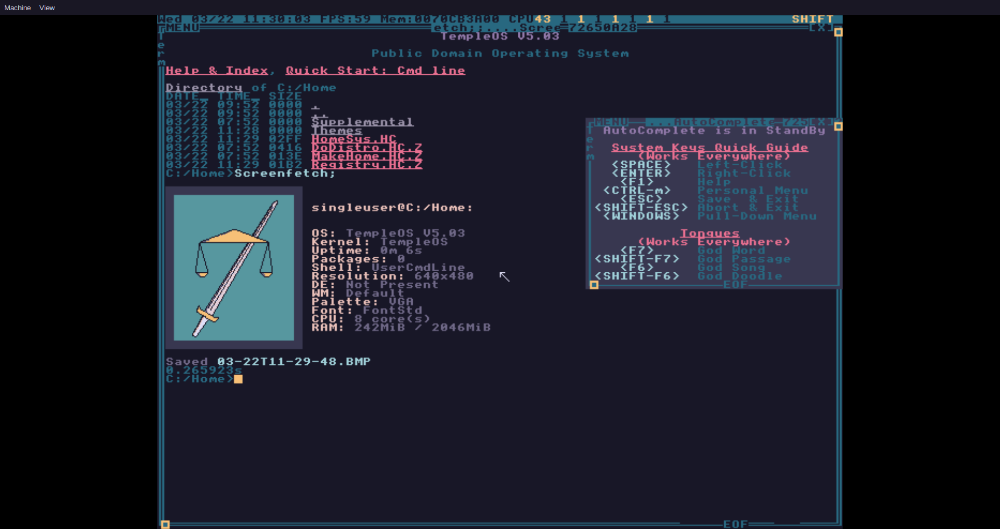
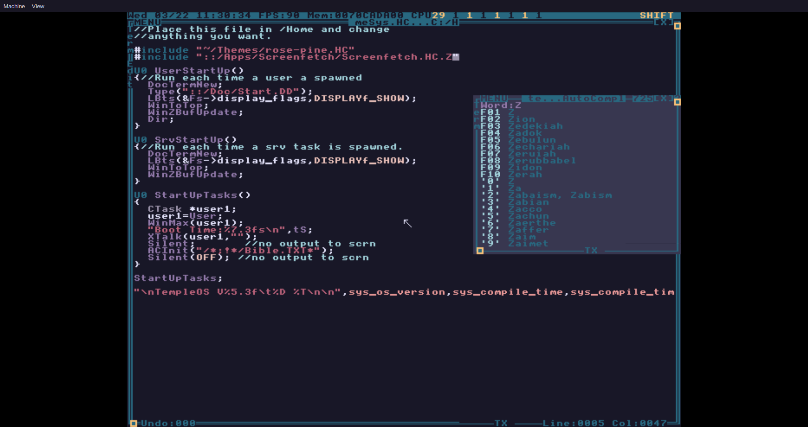

*RIP Terry A. Davis (1969-12-15 to 2018-08-11)*
===============================================

*Original scripts and basic implementation by [tsoding](https://gitlab.com/tsoding), modified and expanded by myself.*

*All themes are approximations of their namesakes and are not 1:1 implementations.
All documents and files contained in this repository are for educational purposes only.
Theme contributions and alternative Windows-specific script contributions are welcomed.*




*rosé pine theme shown; Screenfetch app must be installed separately (see [Additional Software](#additional-software))*


---


Table of Contents
=================

<!--ts-->
* [Overview](#overview)
  * [Dependencies](#dependencies)
* [Usage](#usage)
  * [Installing the base system](#installing-the-base-system)
  * [Running the VM](#running-the-vm)
* [Syncing Files](#syncing-files)
* [Customization](#customization)
  * [Changing the theme](#changing-the-theme)
  * [Installing a different fork of TempleOS](#installing-a-different-fork-of-templeos)
* [Additional Software](#additional-software)
* [Bonus Tips](#bonus-tips)
<!--te-->


---


Overview
========

This repository aims to assist with setting up a complete TempleOS environment via QEMU, including all files from Terry's supplemental `.ISO.C` files on [templeos.org](templeos.org).

These scripts are intended for use on Linux machines; Windows users will need to use a tool like [ImDisk Toolkit](http://www.ltr-data.se/opencode.html/) to mount the virtual TempleOS drive and copy files to/from the VM.

A few notes:

* `C:` and `::` can be used interchangeably in TempleOS to refer to the root of the `C:` drive (with `::` referring to the root of the currently mounted disk)

* `HomeSys.HC` was uncompressed from the `HomeSys.HC.Z` located in `C:` by using the `TOSZ` tool to allow for easy external editing

* These scripts only affect the `C:` drive of a TempleOS installation; the `D:` drive (and any additional drives created when installing the `TinkerOS.ISO`) are kept clean unless manually mounted and edited

Dependencies
------------

- [QEMU](https://www.qemu.org/)
- [rsync](https://rsync.samba.org/)

Scripts use settings from `config.sh`; customize it to your liking. For example, you may want to add the following flag to enable sound: `-audiodev alsa,id=snd0 -machine pcspk-audiodev=snd0`. Replace `alsa` with `pa` for PulseAudio.


---


Usage
=====

Clone this repository with the following command:

```console
$ git clone https://github.com/bubstance/templeos
```

Installing the base system
--------------------------

```console
$ ./install.sh <name>.img

Follow the installer's instructions, then close the VM.

$ ./sync.sh temple <name>.img

Syncs the contents of the included Home directory into the TempleOS image.
```

This will create a raw 512MiB (~537MB) virtual disk image, which is a safe minimum and should be more than enough for most use cases. You can adjust the size by editing the value of `QEMU_IMG_SIZE` in `config.sh`. No suffix indicates kibibytes, `M` is for mebibytes, `G` is for gibibytes.

The supplied base configuration runs TempleOS with 2GiB of RAM and as many CPU cores as your system has available. You can change this by editing the value of the `-m` flag in `config.sh`; the value is in MiB by default. 512MiB is the absolute minimum amount of RAM required for TempleOS to boot.

Running the VM
--------------

```console
$ ./run.sh <name>.img

Boots the installed image.
```

Mounting the entire filesystem (optional)
---------------------------------------------------------

```console
$ ./mount.sh <name>.img
$ cd ./mnt/
```

This will mount the entirety of the TempleOS filesystem to a `mnt` directory created in the primary `templeos` directory. This can be useful for browsing through and editing files that are not contained in `Home`.

You can run the `mount.sh` script multiple times; it unmounts the image before trying to mount it again. The `run.sh` script also unmounts the image before running the VM. You usually don't have to unmount it manually, but if you need to you can always do `umount ./mnt/`.

Networking via `net-run.sh` (for Shrine images)
-----------------------------------------------

Sources `net-config.sh` and runs Shrine with networking enabled.

Displaying in text-only mode with `text-run.sh` (for TinkerOS images)
-----------------------------------------------

Requires installing `TinkerOS` and setting the graphical display mode to `15` during installation.

Sources `text-config.sh` and runs TinkerOS in the text-only 15th mode.


---


Syncing Files
=============

* **NOTE:** the `sync.sh` script does not currently work with TInkerOS or ShrineOS; you need to use `mount.sh` to interact with their filesystems

The subcommand (`temple` or `host`) denotes the target of the sync operation.

From `Host` to `Temple`
-------------------

```console
$ ./sync.sh temple <name>.img
```

From `Temple` to `Host`
-------------------

```console
$ ./sync.sh host <name>.img
```


---


Customization
=============

Changing the theme
------------------

Themes are stored in the `Themes` folder in the `Home` directory.

Edit the `#include` in the `HomeSys.HC` file to source the theme of your choice. The default selection is `gruvbox-light`.

Current theme choices are:

* 

* 

* 

* 

  * 

  * 

  * 

  * 

* 

* 

  * `dark` and `light`

* 

* 

  * `base`, `moon`, and `dawn`

* 

  * `dark` and `light`

* 

Installing a different fork of TempleOS
---------------------------------------

Change the `TEMPLEOS_ISO` variable in `config.sh` to either `TinkerOS.ISO` or `Shrine.ISO`, then use the `install` and `run` scripts as described above.


---


Additional Software
===================

* Try out some TempleOS forks! There's `TinkerOS` from [tinkeros/TinkerOS](https://github.com/tinkeros/TinkerOS), `Shrine` from [minexew/Shrine](https://github.com/minexew/Shrine), and `ZealOS` from [Zeal-Operating-System/ZealOS](https://github.com/Zeal-Operating-System/ZealOS).

* Check out Jeff Irwin's [temple-viewer](https://github.com/JeffIrwin/temple-viewer) STL viewing application! It's really neat.

* You can install the `Screenfetch` application by doing the following:

  * Download `Screenfetch.ISO.C` from [the cia-foundation](https://github.com/cia-foundation/TempleOS-Screenfetch/releases)

  * Remove the `.C` extension and run QEMU with the `-cdrom` flag and the location of the `.ISO`. If you move the `Screenfetch.ISO` into the `templeos` directory, the full command would be something like:

  ```console
  qemu-system-x86_64 -display gtk,zoom-to-fit=on -rtc base=localtime -cdrom Screenfetch.ISO -enable-kvm -m 2048 -smp $(nproc) -hda custom.img
  ```

  This will start TempleOS (or a fork that you installed) with the `Screenfetch.ISO` mounted to the `T:` drive

  * Copy the contents of the auto-mounted `.ISO` in TempleOS by performing the following command:

    ```console
    CopyTree("T:", "::/Apps/Screenfetch");
    ```

    This will automatically create the folder `C:/Apps/Screenfetch` and populate in with the contents of the `.ISO`

  * Add another `#include` to your `HomeSys.HC` that sources `"::/Apps/Screenfetch/Screenfetch.HC.Z"`

  * You will now have access to the `Screenfetch;` command on every subsequent boot

  * \*\***NOTE**\*\* For ShrineOS running with networking, all you need to do is `pkg-install screenfetch` and then source in your `HomeSys.HC` as above


---


Bonus Tips
==========

* To force TempleOS (and ShrineOS) to run at 60FPS, edit the values of `WINMGR_FPS` and `WINMGR_PERIOD` in `C:/Kernel/KernelA.HH.Z` at lines `1478` and `1479` to `60000.0/1001` and `1001/60000.0`, respectively (this is just changing the `3` to a `6`). Jumping to a line can be done quickly by using the keyboard shortcut `<Ctrl+g>`, entering the desired line number, then pressing `<Esc>`

  * \*\***NOTE**\*\* Changing the framerate does not seem to work in TinkerOS

* If you install `TinkerOS.ISO` and set at least one of your drives' graphics mode to `15` during installation, you can then change the `-display gtk` setting in `config.sh` to `-display curses` and get a nice text-only version that works inside of a terminal or TTY

* You can use the `TOSZ` application made by Terry to uncompress `HC.Z` files *(Linux only)*

  * `chmod +x make_tosz`, then run it in the same directory as `TOSZ.CPP` to make the `TOSZ` executable

  * Run `TOSZ` on the file you wish to uncompress (for example: `./TOSZ -ascii MakeHome.HC.Z`)

* Here's handy tip from [Jeff Irwin](https://github.com/jeffirwin) on changing the default keyboard layout to Dvorak ([via Reddit](https://old.reddit.com/r/TempleOS_Official/comments/p4k9xa/text_editor_and_dvorak/ijwuefp/)):

>Open up `C:/Kernel/SerialDev/Keyboard.HC.Z` with the editor `Ed`. The first several lines are like this:
>
>```
>asm {
>
>NORMAL_KEY_SCAN_DECODE_TABLE::
>    DU8 0,CH_ESC,"1234567890-=",CH_BACKSPACE,'\t';
>    DU8 "qwertyuiop[]",'\n',0,"as";
>    DU8 "dfghjkl;'\`",0,"\\zxcv";
>    DU8 "bnm,./",0,'*',0,CH_SPACE,0,0,0,0,0,0;
>    DU8 0,0,0,0,0,0,0,0,0,0,'-',0,0,0,'+',0;
>
>SHIFT_KEY_SCAN_DECODE_TABLE::
>    DU8 0,CH_SHIFT_ESC,"!@#$$%^&*()_+",CH_BACKSPACE,'\t';
>    DU8 "QWERTYUIOP{}",'\n',0,"AS";
>    DU8 "DFGHJKL:\"~",0,"|ZXCV";
>    DU8 "BNM<>?",0,'*',0,CH_SHIFT_SPACE,0,0,0,0,0,0;
>    DU8 0,0,0,0,0,0,0,0,0,0,'-',0,0,0,'+',0;
>```
>
>Keep the `asm {` part, but replace the QWERTY tables with this:
>
>```
>NORMAL_KEY_SCAN_DECODE_TABLE::
>    DU8 0,CH_ESC,"1234567890[]",CH_BACKSPACE,'\t';
>    DU8 "',.pyfgcrl/=",'\n',0,"ao";
>    DU8 "euidhtns-\`",0,"\\;qjk";
>    DU8 "xbmwvz",0,'*',0,CH_SPACE,0,0,0,0,0,0;
>    DU8 0,0,0,0,0,0,0,0,0,0,'-',0,0,0,'+',0;
>
>SHIFT_KEY_SCAN_DECODE_TABLE::
>    DU8 0,CH_SHIFT_ESC,"!@#$$%^&*(){}",CH_BACKSPACE,'\t';
>    DU8 "\"<>PYFGCRL?+",'\n',0,"AO";
>    DU8 "EUIDHTNS_~",0,"|:QJK";
>    DU8 "XBMWVZ",0,'*',0,CH_SHIFT_SPACE,0,0,0,0,0,0;
>    DU8 0,0,0,0,0,0,0,0,0,0,'-',0,0,0,'+',0;
>```
>
>If you're copy/pasting, great! If you're typing it manually, be careful to escape the double quote in the shift table like `\"`. There's a Ctrl key table too which I haven't bothered editing yet.
>
>Finally, recompile with `BootHDIns;` and `Reboot;`

This would, of course, also apply to any other keyboard layout you wish to map (AZERTY, QWERTZ, etc.)
